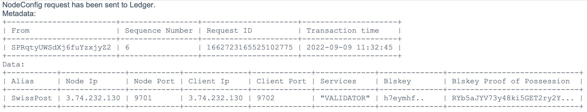

# Add new node to pool (claim ownership)

Make sure you have the pool_transactions_genesis file at hand to add your node to the ledger config.

    indy-cli --config ~/cliconfig
    indy> pool create swiss_sandbox gen_txn_file=<your_path>/pool_transactions_genesis
    indy> pool connect swiss_sandbox
    indy> wallet list
    indy> wallet open swiss_sandbox_wallet key
    Enter value for key: <WALLET_KEY>
    indy> did list
    indy> did use <steward-did-value>
    indy> ledger node target=<NODE-VERKEY> \
                    client_port=9702 \
                    client_ip=<NODE-IP>  \
                    alias=<NODE-ALIAS> \
                    node_ip=<NODE-IP> \
                    node_port=9701 \
                    services=VALIDATOR \
                    blskey=<NODE-BLSKEY> \
                    blskey_pop=<NODE-POP-KEY>

As a result you should get something like this:

2. Copy Genesis file to ledger config

On the node vm copy the genesis files to the ledger config.

    sudo cp pool_transactions_genesis domain_transactions_genesis \
    ~/indy-node-container/run/lib_indy/swiss_sandbox/