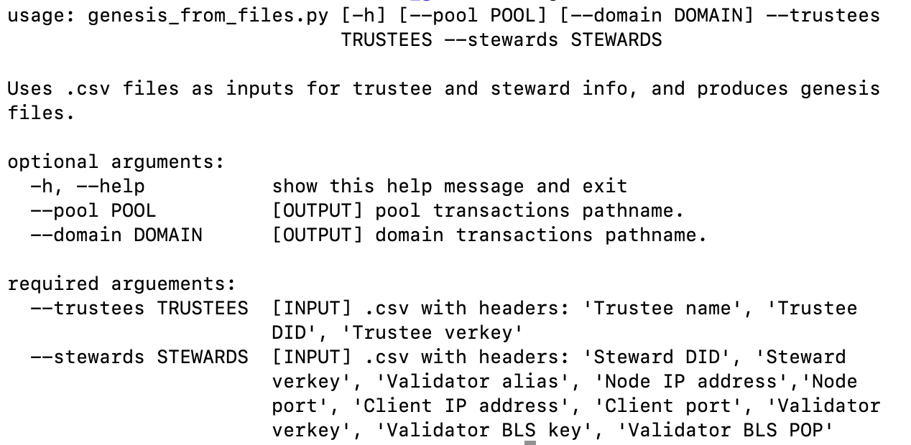

# Generate Genesis Files

see also: [steward-tools/create_genesis](
https://github.com/sovrin-foundation/steward-tools/tree/master/create_genesis)

The following needs only to be run once (on one node) and the resulting files have to be distrubuted to the other nodes.

To run the **genesis_from_files.py** script, the indy_node (python) package must be installed.

The easiest way is to (mis)use the indy_controller image to run the script inside.

So login to the indy node vm and follow the steps below:

1. clone the steward tools

        git clone https://github.com/sovrin-foundation/steward-tools.git
        cd steward-tools/create_genesis/

2. test run

        sudo docker run --rm -it -v "$(pwd)":/create_genesis \
          ghcr.io/hyperledger/indy-node-container/indy_node_controller \
          /create_genesis/genesis_from_files.py -h

    You get the following output:

    

3. create the two csv input files:

    Create a **trustees.csv** and **stewards.csv** file with the headers/columns mentioned above in the usage message. Copy the corresponding values from the emails you have gotton from the other node admins:  

4. run  the create script:

        sudo docker run --rm -it -v "$(pwd)":/create_genesis \
            ghcr.io/hyperledger/indy-node-container/indy_node_controller \
            /create_genesis/genesis_from_files.py \
            --trustees /create_genesis/trustees.csv \
            --stewards /create_genesis/stewards.csv \
            --pool /create_genesis/pool_transactions \
            --domain /create_genesis/domain_transactions

5. copy the genesis file to the node config

        sudo cp pool_transactions_genesis domain_transactions_genesis \
        ~/indy-node-container/run/lib_indy/swiss_sandbox/